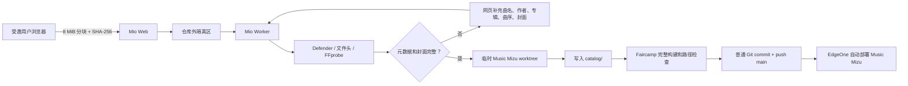

# Mio Core 详细使用手册

> 适用版本：`main` 分支，Mio Core `0.1.0`  
> 更新日期：2026-07-23  
> 项目仓库：<https://github.com/Nightmizus/mio-core>

本文面向 Mio Core 的服务器管理员和受邀成员。它从一台全新的 Windows 10/11
旧电脑开始，说明如何安装、配置、上线和维护 Mio Core，并解释用户如何通过网页
与 Mio 对话、上传音乐和自动发布到 Music Mizu。

真实的 API Key、会话密钥、初始化令牌和 SSH 私钥都只能保存在服务器本地，
不得写进 Git、截图、聊天记录或公开日志。

## 目录

- [1. Mio Core 做什么](#1-mio-core-做什么)
- [2. 组件、端口和数据流](#2-组件端口和数据流)
- [3. 部署前准备](#3-部署前准备)
- [4. 本地测试运行](#4-本地测试运行)
- [5. 生产环境变量](#5-生产环境变量)
- [6. 配置 Music Mizu Deploy Key](#6-配置-music-mizu-deploy-key)
- [7. 安装为 Windows 服务](#7-安装为-windows-服务)
- [8. 首次初始化管理员](#8-首次初始化管理员)
- [9. 管理员日常操作](#9-管理员日常操作)
- [10. 成员使用网页](#10-成员使用网页)
- [11. 音乐发布流水线](#11-音乐发布流水线)
- [12. 内网穿透和 HTTPS](#12-内网穿透和-https)
- [13. 备份、恢复和升级](#13-备份恢复和升级)
- [14. 运行监控和故障排查](#14-运行监控和故障排查)
- [15. API 摘要](#15-api-摘要)
- [16. 安全与隐私](#16-安全与隐私)
- [17. 上线验收清单](#17-上线验收清单)

## 1. Mio Core 做什么

Mio Core 是 Music Mizu 的受控运营后端，不是一个可以任意执行 Shell 的通用 Agent。

它提供：

- 邀请制账号和私人聊天；
- Kimi 流式聊天；
- 8 MiB 分块、断点续传的音乐上传；
- 文件头、SHA-256、FFprobe 和可选 Windows Defender 校验；
- 音频标签与内嵌封面读取；
- 缺少曲名、作者、专辑、曲序或封面时的补充表单；
- Faircamp 目录生成、完整构建和输出检查；
- 只向 `shizwd/musicmizu` 推送的受控 Git 流水线；
- 管理员任务日志、失败重试和正常 Git revert 回滚；
- SQLite 持久化、备份恢复和服务重启后的任务恢复。

它明确不提供：

- 面向用户或模型的 Shell；
- 任意文件路径读写；
- 任意 Git 仓库、分支或参数；
- 向 Kimi 发送音乐文件内容、服务器路径、Deploy Key 或其他密钥；
- force push。

## 2. 组件、端口和数据流

### 2.1 运行组件

| 组件 | 默认位置或端口 | 作用 |
| --- | --- | --- |
| `MioWeb` / `mio-web` | `127.0.0.1:8787` | 前端、认证、聊天、上传和状态 API |
| `MioWorker` / `mio-worker` | 无监听端口 | 串行处理校验、Faircamp 构建和 Git 推送 |
| SQLite | `C:\MioCore\data\mio.db` | 用户、聊天、上传、任务、审计和发布记录 |
| 隔离与上传区 | `C:\MioCore\data` | 分块、合并后的原始音频、封面和 Deploy Key |
| Git 工作区 | `C:\MioCore\workspaces` | bare clone、临时 worktree 和跨进程发布锁 |
| HTTPS 隧道/反代 | 由你选择 | 把公网 HTTPS 转发到 `127.0.0.1:8787` |
| EdgeOne | 监听 Music Mizu | 继续从 `shizwd/musicmizu` 的 `main` 自动部署 |

Mio Core 只允许绑定 `127.0.0.1`、`::1` 或 `localhost`。不要把应用本身直接绑定到
`0.0.0.0`，公网访问应由受 TLS 保护的隧道或反向代理完成。

### 2.2 一首歌从浏览器到网站



上传和发布是确定性流水线。Kimi 可以解释状态，或在协议支持时调用只读的任务查询
工具，但不能决定磁盘路径、命令或 Git 参数。

## 3. 部署前准备

### 3.1 系统要求

建议使用 64 位 Windows 10/11，安装以下工具：

| 依赖 | 要求 | 用途 |
| --- | --- | --- |
| Python | 3.12，安装 `py` launcher | 后端、Worker、Alembic |
| Node.js | 22 LTS，带 Corepack | 构建 React 前端 |
| Git for Windows | 系统级安装，加入系统 `PATH` | clone、worktree、commit、push |
| OpenSSH Client | `ssh.exe`、`ssh-keygen.exe`、`ssh-keyscan.exe` | Deploy Key |
| FFmpeg / FFprobe | 二者都可执行 | 音频分析和内嵌封面提取 |
| Faircamp | 与 Music Mizu 当前目录兼容的版本 | 静态音乐站构建 |
| WinSW | 稳定版 `WinSW-x64.exe` | 把 Web 和 Worker 安装为服务 |
| HTTPS 隧道或反代 | 支持 SSE 和大请求 | 公网访问 |

官方入口：

- [Python for Windows](https://www.python.org/downloads/windows/)
- [Node.js 22 下载归档](https://nodejs.org/en/download/archive/v22)
- [Git for Windows](https://git-scm.com/download/win)
- [FFmpeg 下载](https://ffmpeg.org/download.html)
- [Faircamp Windows 指南](https://simonrepp.com/faircamp/windows.html)
- [WinSW Releases](https://github.com/winsw/winsw/releases)
- [Kimi Code API 文档](https://www.kimi.com/code/docs/)

安装 Git、Python 和 Node.js 时应选择“所有用户”，否则低权限服务账号可能找不到命令。

### 3.2 检查依赖

在新的 PowerShell 窗口执行：

```powershell
py -3.12 --version
node --version
corepack --version
git --version
ssh -V
ffmpeg -version
ffprobe -version
& 'C:\Tools\faircamp\faircamp.exe' --version
```

任何一项提示“无法识别命令”时，先修复系统 `PATH` 或在 `.env` 中填写绝对路径。
Git 本身没有单独的配置项，因此 `git.exe` 必须位于 Mio 服务账号的系统 `PATH`。

### 3.3 获取源码

生产机建议使用独立目录，不要复用你平时手工维护 Music Mizu 的桌面 checkout：

```powershell
Set-Location C:\
git clone https://github.com/Nightmizus/mio-core.git MioCore-src
Set-Location C:\MioCore-src
```

`mio-core` 是后端代码仓库；它将使用自己的 bare clone 操作
`git@github.com:shizwd/musicmizu.git`。两者不要混为一个工作目录。

## 4. 本地测试运行

本节适合首次验收或开发调试。生产服务器请继续阅读
[第 7 节](#7-安装为-windows-服务)。

### 4.1 建立本地配置

```powershell
Set-Location C:\Users\你的用户名\Documents\mio-core
Copy-Item .env.example .env
```

把 `.env` 中的数据目录改为当前项目的相对目录，并暂时关闭安全 Cookie：

```dotenv
MIO_ENV=development
MIO_HOST=127.0.0.1
MIO_PORT=8787
MIO_PUBLIC_URL=http://127.0.0.1:8787
MIO_DATA_DIR=.\data
MIO_WORKSPACES_DIR=.\workspaces
MIO_DATABASE_URL=sqlite:///data/mio.db
MIO_SESSION_SECRET=替换为随机长字符串
MIO_BOOTSTRAP_TOKEN=替换为另一个一次性随机字符串
MIO_SECURE_COOKIES=false
```

生成随机值的 PowerShell 函数：

```powershell
function New-MioSecret {
    $bytes = New-Object byte[] 48
    $rng = [System.Security.Cryptography.RandomNumberGenerator]::Create()
    try {
        $rng.GetBytes($bytes)
        [Convert]::ToBase64String($bytes)
    }
    finally {
        $rng.Dispose()
    }
}

New-MioSecret  # 用作 MIO_SESSION_SECRET
New-MioSecret  # 用作 MIO_BOOTSTRAP_TOKEN，必须与上一个不同
```

### 4.2 安装后端和前端

```powershell
py -3.12 -m venv .venv
.\.venv\Scripts\python.exe -m pip install --upgrade pip
.\.venv\Scripts\python.exe -m pip install -e ".[dev]"

Push-Location frontend
corepack pnpm install --frozen-lockfile
corepack pnpm run build
Pop-Location

.\.venv\Scripts\python.exe -m alembic upgrade head
```

前端必须先构建。只有存在 `frontend\dist` 时，FastAPI 才会提供完整网页。

### 4.3 启动两个进程

终端一：

```powershell
Set-Location C:\Users\你的用户名\Documents\mio-core
.\.venv\Scripts\python.exe -m mio_core.main
```

终端二：

```powershell
Set-Location C:\Users\你的用户名\Documents\mio-core
.\.venv\Scripts\python.exe -m mio_core.worker
```

检查：

```powershell
Invoke-RestMethod http://127.0.0.1:8787/api/health
```

正常结果类似：

```json
{
  "status": "ok",
  "llmConfigured": true
}
```

`llmConfigured` 只表示服务器读取到了非空 API Key，不代表 Kimi 网络请求已经验证成功。
实际连接会在第一次聊天时验证。

打开 <http://127.0.0.1:8787>，完成首次管理员初始化。

### 4.4 运行测试

```powershell
.\.venv\Scripts\python.exe -m ruff check mio_core tests
.\.venv\Scripts\python.exe -m pytest --cov=mio_core

Push-Location frontend
corepack pnpm run build
Pop-Location
```

## 5. 生产环境变量

### 5.1 推荐的 `.env`

生产配置放在 `C:\MioCore\app\.env`。安装脚本会复制源码根目录中未提交的 `.env`，
所以最省事的做法是在执行安装脚本前，先在部署 checkout 中配置好它。

```dotenv
MIO_ENV=production
MIO_HOST=127.0.0.1
MIO_PORT=8787
MIO_PUBLIC_URL=https://mio.example.com

MIO_DATA_DIR=C:\MioCore\data
MIO_WORKSPACES_DIR=C:\MioCore\workspaces
MIO_DATABASE_URL=sqlite:///C:/MioCore/data/mio.db

MIO_SESSION_SECRET=替换为至少32字符的高熵随机值
MIO_BOOTSTRAP_TOKEN=替换为另一个一次性随机值
MIO_SECURE_COOKIES=true

MIO_LLM_API_KEY=在服务器本地填写真实KimiKey
MIO_LLM_BASE_URL=https://api.kimi.com/coding/v1
MIO_LLM_MODEL=kimi-for-coding

MIO_MUSIC_REMOTE=git@github.com:shizwd/musicmizu.git
MIO_MUSIC_BRANCH=main
MIO_GIT_SSH_COMMAND=ssh -i C:/MioCore/data/keys/musicmizu -o IdentitiesOnly=yes -o BatchMode=yes -o StrictHostKeyChecking=yes -o UserKnownHostsFile=C:/MioCore/data/keys/known_hosts

MIO_FAIRCAMP_PATH=C:\MioCore\app\tools\faircamp.exe
MIO_FFMPEG_PATH=C:\MioCore\app\tools\ffmpeg\ffmpeg.exe
MIO_FFPROBE_PATH=C:\MioCore\app\tools\ffmpeg\ffprobe.exe
MIO_POWERSHELL_PATH=powershell.exe
MIO_ENABLE_DEFENDER_SCAN=true
```

站点必须部署在域名根路径，例如 `https://mio.example.com/`。当前前端没有为
`https://example.com/mio/` 这样的子路径部署设置 base path。

### 5.2 配置项说明

| 配置项 | 生产建议 | 说明 |
| --- | --- | --- |
| `MIO_ENV` | `production` | 运行环境标记 |
| `MIO_HOST` | `127.0.0.1` | 代码会拒绝公网地址 |
| `MIO_PORT` | `8787` | 隧道/反代的本地目标端口 |
| `MIO_PUBLIC_URL` | 公网 HTTPS 根地址 | 用于生成邀请链接 |
| `MIO_DATA_DIR` | `C:\MioCore\data` | 数据库、聊天、音频、封面、密钥 |
| `MIO_WORKSPACES_DIR` | `C:\MioCore\workspaces` | bare repo、worktree、发布锁 |
| `MIO_DATABASE_URL` | `sqlite:///C:/MioCore/data/mio.db` | SQLite 连接串 |
| `MIO_SESSION_SECRET` | 独立随机值 | HMAC 会话和邀请令牌 |
| `MIO_BOOTSTRAP_TOKEN` | 一次性随机值 | 只用于第一个管理员 |
| `MIO_SECURE_COOKIES` | 公网必须 `true` | 仅通过 HTTPS 发送登录 Cookie |
| `MIO_LLM_API_KEY` | 仅服务器本地填写 | Kimi API Key |
| `MIO_LLM_BASE_URL` | `https://api.kimi.com/coding/v1` | OpenAI-compatible Base URL |
| `MIO_LLM_MODEL` | `kimi-for-coding` | 当前实现默认模型 |
| `MIO_LLM_TIMEOUT_SECONDS` | `60` | 单次 Kimi 请求超时 |
| `MIO_LLM_GLOBAL_CONCURRENCY` | `2` | 全局 Kimi 并发上限 |
| `MIO_MUSIC_REMOTE` | Music Mizu SSH URL | Worker 唯一允许推送的目标 |
| `MIO_MUSIC_BRANCH` | `main` | EdgeOne 监听的分支 |
| `MIO_GIT_SSH_COMMAND` | 专用私钥与严格主机检查 | 非交互 Git SSH |
| `MIO_FAIRCAMP_PATH` | 绝对路径 | Faircamp 可执行文件 |
| `MIO_FFMPEG_PATH` | 绝对路径 | 封面提取 |
| `MIO_FFPROBE_PATH` | 绝对路径 | 音频分析 |
| `MIO_POWERSHELL_PATH` | `powershell.exe` | 调用 Music Mizu 构建脚本 |
| `MIO_ENABLE_DEFENDER_SCAN` | `true` | 启用 Defender 自定义扫描 |
| `MIO_CHUNK_SIZE` | `8388608` | 分块字节数；前端当前固定为同样的 8 MiB |
| `MIO_MAX_FILE_SIZE` | `524288000` | 单文件最大字节数 |
| `MIO_MAX_BATCH_SIZE` | `5368709120` | 每用户进行中上传最大字节数 |
| `MIO_COMMAND_TIMEOUT_SECONDS` | `900` | Git、Faircamp 等外部命令超时 |

代码内默认限制：

- 8 MiB/分块；
- 500 MiB/文件；
- 每位用户同时处于上传中的文件合计 5 GiB；
- 每位用户同时一个 Kimi 请求；
- 全局同时两个 Kimi 请求；
- 全局一个 Git 发布任务；
- 外部命令默认 900 秒超时；
- 登录会话有效期 30 天；
- 单条聊天消息最多 12,000 字符；
- 补充封面只接受 12 MiB 以内的 JPEG 或 PNG。

容量、并发和超时字段可通过上表中的高级环境变量覆盖，但 `.env.example` 只列出常用
配置。不要单独修改 `MIO_CHUNK_SIZE`：浏览器前端当前固定使用 8 MiB，前后端不一致会
导致分块数量校验失败。调整任何限制后都应重新运行测试和完整上传验证。

### 5.3 Kimi 配置注意事项

Mio Core 使用：

```text
Base URL: https://api.kimi.com/coding/v1
Endpoint: https://api.kimi.com/coding/v1/chat/completions
Model: kimi-for-coding
User-Agent: mio-core/<version>
```

服务启动后的第一次聊天会按协议能力决定是否提供受控只读工具。即使 Kimi 不支持工具、
发生 429、超时或断网，已进入 Worker 的音乐发布任务仍能独立运行。

Kimi 官方将 Kimi Code 主要定位为编程 Agent 和开发工具接入，并为产品集成、团队用量
管理另行提供开放平台。把聊天能力开放给多位受邀用户前，请再次确认当前账号、订阅和
API Key 的使用方式符合最新服务条款与配额政策；不符合时应实现新的 `LLMProvider`，
而不是伪装客户端或绕过限制。

不要：

- 把 Key 写入前端；
- 把 Key 提交到 Git；
- 在聊天中粘贴 Key；
- 修改 User-Agent 冒充其他客户端；
- 让服务账号和日常个人 Kimi Key 共用不必要的权限。

修改 Kimi 配置后需要重启 `MioWeb`。

## 6. 配置 Music Mizu Deploy Key

### 6.1 为什么必须使用 Deploy Key

Deploy Key 只绑定到 `shizwd/musicmizu`，比个人 SSH Key 的权限范围小。Mio Core
不需要访问你的其他仓库，也不应保存 GitHub 个人访问令牌。

### 6.2 生成专用密钥

先创建密钥目录：

```powershell
New-Item -ItemType Directory -Force C:\MioCore\data\keys
```

生成 Ed25519 密钥：

```powershell
ssh-keygen -t ed25519 `
  -f C:\MioCore\data\keys\musicmizu `
  -C mio-core
```

Worker 以非交互服务运行。若没有额外配置 `ssh-agent`，此专用密钥需要留空 passphrase，
并依靠 Windows ACL、低权限服务账号和磁盘加密保护。

生成：

```text
C:\MioCore\data\keys\musicmizu
C:\MioCore\data\keys\musicmizu.pub
```

私钥永远不要上传。只复制 `.pub` 内容：

```powershell
Get-Content C:\MioCore\data\keys\musicmizu.pub
```

### 6.3 在 GitHub 添加写权限

1. 打开 `shizwd/musicmizu`。
2. 进入 **Settings → Deploy keys → Add deploy key**。
3. Title 填 `Mio Core old PC` 等可识别名称。
4. Key 粘贴 `musicmizu.pub` 内容。
5. 勾选 **Allow write access**。
6. 保存。

Deploy Key 必须由 `shizwd/musicmizu` 的仓库所有者配置。只在 `Nightmizus/mio-core`
仓库添加密钥没有作用。

### 6.4 建立可信主机文件

```powershell
ssh-keyscan -t ed25519 github.com |
    Set-Content -LiteralPath C:\MioCore\data\keys\known_hosts -Encoding ascii
```

在信任前，应对照
[GitHub 官方 SSH key fingerprints](https://docs.github.com/en/authentication/keeping-your-account-and-data-secure/githubs-ssh-key-fingerprints)
核验主机指纹。不要通过关闭 `StrictHostKeyChecking` 绕过验证。

### 6.5 限制文件权限

安装服务账号后，确保：

- `mio-service` 只能读取私钥；
- `Administrators` 和 `SYSTEM` 保留管理权限；
- 普通本地用户不能读取 `C:\MioCore\data`；
- 备份介质同样受 ACL 或磁盘加密保护。

### 6.6 测试只读连接

先在与服务相同的账号和环境中测试：

```powershell
$env:GIT_SSH_COMMAND = 'ssh -i C:/MioCore/data/keys/musicmizu -o IdentitiesOnly=yes -o BatchMode=yes -o StrictHostKeyChecking=yes -o UserKnownHostsFile=C:/MioCore/data/keys/known_hosts'
git ls-remote git@github.com:shizwd/musicmizu.git refs/heads/main
Remove-Item Env:\GIT_SSH_COMMAND
```

正常会输出 `main` 的提交哈希。此命令只读，不会推送。

## 7. 安装为 Windows 服务

### 7.1 推荐目录

```text
C:\MioCore\
  app\             应用、前端构建、虚拟环境、WinSW
  data\            SQLite、聊天、音频、封面、Deploy Key
  workspaces\      bare Git 仓库、临时 worktree、锁
```

`scripts\install.ps1` 目前只支持这个根目录，故意拒绝其他安装根路径。

### 7.2 创建低权限服务账号

以管理员 PowerShell 执行：

```powershell
$servicePassword = Read-Host 'mio-service password' -AsSecureString
New-LocalUser `
  -Name 'mio-service' `
  -Password $servicePassword `
  -PasswordNeverExpires `
  -UserMayNotChangePassword `
  -Description 'Mio Core service account'

New-Item -ItemType Directory -Force `
  C:\MioCore\app, C:\MioCore\data, C:\MioCore\workspaces

icacls C:\MioCore /grant "$env:COMPUTERNAME\mio-service:(OI)(CI)M" /T
```

在 `secpol.msc` 中进入：

```text
本地策略 → 用户权限分配 → 作为服务登录
```

加入 `mio-service`。不要把这个账号加入 Administrators，也不要用于日常登录。

如果 Windows 版本没有本地安全策略图形界面，请使用组织允许的账号/组策略工具授予
`Log on as a service`，不要为了省事让服务长期使用管理员账号。

### 7.3 准备工具和 `.env`

在部署 checkout 中放置工具，例如：

```text
C:\MioCore-src\
  tools\
    faircamp.exe
    ffmpeg\
      ffmpeg.exe
      ffprobe.exe
      其他随发行包提供的 DLL
```

然后在 `C:\MioCore-src\.env` 填好第 5 节的生产配置。`.env` 已在 `.gitignore`，
确认它没有被 Git 跟踪：

```powershell
Set-Location C:\MioCore-src
git status --short -- .env
git check-ignore .env
```

第二条应输出 `.env`。

### 7.4 执行安装

下载官方 WinSW 稳定版 `WinSW-x64.exe`。在管理员 PowerShell 中：

```powershell
Set-Location C:\MioCore-src

.\scripts\install.ps1 `
  -ServiceUser '.\mio-service' `
  -ServicePassword (Read-Host 'mio-service password' -AsSecureString) `
  -WinSWPath 'C:\Users\你的用户名\Downloads\WinSW-x64.exe'
```

安装脚本会：

1. 镜像源码到 `C:\MioCore\app`，排除 `.git`、`.venv`、`node_modules`、`data` 和
   `workspaces`；
2. 创建 Python 3.12 虚拟环境；
3. 安装后端；
4. 使用锁文件安装前端依赖并构建；
5. 生成 `MioWeb.xml` 和 `MioWorker.xml`；
6. 安装并启动两个自动恢复的 Windows 服务。

安装过程需要从 Python 和 npm/pnpm 仓库下载依赖。

### 7.5 检查服务

```powershell
Get-Service MioWeb, MioWorker |
    Format-Table Name, Status, StartType

Invoke-RestMethod http://127.0.0.1:8787/api/health
```

两项服务都应为 `Running`。WinSW 日志通常位于：

```text
C:\MioCore\app\MioWeb*.log
C:\MioCore\app\MioWorker*.log
```

重启：

```powershell
C:\MioCore\app\MioWorker.exe restart
C:\MioCore\app\MioWeb.exe restart
```

修改 `.env` 后应同时重启。先停 Worker、再停 Web；启动时先 Web、再 Worker也可以，
但两者最终必须都运行。

## 8. 首次初始化管理员

1. 确认 `.env` 中存在非空 `MIO_BOOTSTRAP_TOKEN`。
2. 打开本地地址或已经配置好的 HTTPS 域名。
3. 在登录页选择 **首次运行？初始化管理员**。
4. 输入初始化令牌、管理员用户名和密码。
5. 提交后会自动登录。

用户名规则：

- 2–48 个字符；
- 可使用字母、数字、中文、日文、下划线和连字符。

密码规则：

- 10–256 个字符；
- 使用 Argon2id 保存；
- 建议使用密码管理器生成的独立长密码。

只要数据库中已经有用户，初始化接口就会拒绝再次执行。初始化成功后：

1. 从 `C:\MioCore\app\.env` 删除 `MIO_BOOTSTRAP_TOKEN` 的值，保留为空；
2. 重启 `MioWeb`；
3. 不要把初始化令牌留在聊天或运维笔记中。

## 9. 管理员日常操作

### 9.1 生成邀请

进入左侧 **管理面板**，点击 **生成邀请**。

当前网页生成：

- `member` 角色；
- 72 小时有效；
- 一次性使用。

点击 **复制** 后通过可信渠道发给目标用户。邀请 URL 中包含一次性令牌，泄露后应立即
点击 **撤销** 并重新生成。邀请一旦使用，不能再次使用或撤销。

`MIO_PUBLIC_URL` 必须填写真实 HTTPS 域名，否则复制出来的邀请链接会指向错误地址。

### 9.2 查看任务与日志

管理面板最多显示最近 100 个任务，可查看：

- 曲名或任务 ID；
- 当前状态；
- Music Mizu 提交哈希；
- 失败原因；
- 按时间排序的任务事件。

错误信息可能包含工具输出，但实现会截断长度。公开截图前仍应检查是否含本机路径。

### 9.3 重试失败任务

只有状态为 `failed` 的任务显示 **重试**。

重试会：

- 清除上次错误；
- 把任务重新置为 `analyzing`；
- 重新执行文件分析、构建和推送；
- 保留任务 ID 与审计记录。

先处理根因再重试。例如缺少 Faircamp、SSH 权限错误或代理断网不会因为连续点击而消失。

### 9.4 回滚发布

**发布与回滚** 中可以回滚尚未回滚的发布。Mio Core 会：

1. 从最新远端 `main` 创建 worktree；
2. 对原发布提交执行普通 `git revert`；
3. 重新构建并检查 Faircamp 输出；
4. 推送新的回滚提交。

它不会 force push，也不会改写 Git 历史。回滚成功后，发布动态会标记为“已回滚”，
EdgeOne 将按照新的 `main` 自动部署。

## 10. 成员使用网页

### 10.1 接受邀请和登录

打开管理员发来的 `/invite/<token>` 链接，设置用户名和至少 10 位密码。成功后邀请立即
失效并自动登录。

登录会话通过 `HttpOnly`、`SameSite=Lax` Cookie 保存，有效期 30 天；写操作还需要
CSRF Token。公网部署必须启用 HTTPS 和 `MIO_SECURE_COOKIES=true`。

### 10.2 与 Mio 聊天

进入 **与 Mio 对话** 后可以：

- 询问上传和发布状态；
- 说明希望如何整理音乐；
- 获取缺失元数据提示；
- 让 Mio 通过受控只读工具查询自己的近期任务。

对话按用户隔离，其他成员和普通管理员界面不会展示私人聊天。为了生成回复，最近最多
30 条用户/助手消息会发送给已配置的 Kimi API。不要在聊天中发送不希望交给模型服务商
处理的敏感内容。

聊天不可用不等于发布不可用。Kimi 断网或限流时，Worker 仍能继续处理已经排队的音乐。

### 10.3 上传音乐

点击 **＋ 上传音乐**，可以一次选择一个或多个文件。多个文件会由浏览器依次上传，
发布 Worker 全局串行处理。

支持扩展名：

```text
.flac  .mp3  .m4a  .ogg  .opus  .wav
```

上传过程：

1. 浏览器按 8 MiB 分块；
2. 每块计算 SHA-256；
3. 服务器记录已经接收的分块；
4. 全部分块完成后合并并校验完整文件；
5. 生成发布任务。

浏览器会用文件名、文件大小和最后修改时间在 `localStorage` 保存上传 ID。网络中断或
刷新后，重新选择同一个文件可以从服务器记录的分块位置续传。清除站点数据、换浏览器、
修改文件或服务器删除上传记录后，断点信息会失效。

### 10.4 自动读取标签和封面

Worker 读取：

- `title`；
- `artist`，缺少时尝试 `album_artist`；
- `album`；
- `track`；
- 第一个内嵌图片流。

标签被视为不可信文本，只会清洗后用于确定性目录模板，不会变成 Agent 指令。

若缺少字段，任务会进入 **等待补充信息**，发布卡片出现对应输入框。补齐：

- 曲名；
- 作者；
- 专辑；
- 曲序，范围 1–999；
- 封面，JPEG/PNG，最大 12 MiB。

补充封面会统一写入任务目录的 `cover.jpg`。源音乐文件不会重新编码或覆盖。

### 10.5 查看发布结果

发布卡片依次显示：

```text
Mio 正在分析
等待补充信息
正在整理目录
正在构建站点
正在生成提交
正在推送
已上线 / 发布失败
```

`已上线` 表示 Git 已成功推送到 Music Mizu 的 `main`。EdgeOne 仍可能需要一点时间完成
自己的构建/部署。

**发布动态** 对所有已登录成员可见，只包含成功发布的标题、发布者、时间和提交哈希；
私人聊天不会出现在这里。

## 11. 音乐发布流水线

### 11.1 文件校验

文件先进入仓库外的隔离区，然后执行：

1. 文件大小和分块数量检查；
2. 每块 SHA-256；
3. 合并后文件大小和完整 SHA-256；
4. 重复内容哈希检查；
5. 扩展名和文件头匹配；
6. 可选 Windows Defender 自定义扫描；
7. FFprobe 音频流和标签检查；
8. FFmpeg 内嵌封面提取。

压缩包、脚本、可执行文件、Windows 设备名、绝对路径、`..`、符号链接和 reparse point
会被拒绝。

### 11.2 写入 Music Mizu

发布采用：

```text
catalog/<release-slug>/
  release.eno
  cover.jpg
  01/
    01 - Track Title.flac
    track.eno
    cover.jpg
```

实际扩展名保留上传源文件的格式。源音频不重新编码；Faircamp 构建自己的网页流媒体输出。

如果同一专辑的相同曲序目录已经存在，任务会失败，避免覆盖旧曲。此时应由管理员确认
是曲序填写错误、重复上传，还是需要先人工调整目录。

### 11.3 Git 隔离

每个发布任务：

1. 更新 `C:\MioCore\workspaces\musicmizu.git` bare clone；
2. 从最新 `origin/main` 创建临时 detached worktree；
3. 只允许修改 `catalog/`、`dist/` 和自动索引文件；
4. 运行 `scripts\build.ps1 -FaircampPath <配置路径>`；
5. 检查 `dist\index.html`、`dist\library.json` 和 `dist\custom.js`；
6. 生成带上传用户名和任务 ID 的提交；
7. 非强制推送 `main`；
8. 清理临时 worktree。

如果远端 `main` 在推送期间发生变化，任务会从最新远端自动重建一次。再次竞争或冲突时
进入 `failed`，由管理员检查后重试。

### 11.4 Music Mizu 前置条件

目标仓库必须保留：

- `scripts\build.ps1`；
- `scripts\generate-library.ps1`；
- 从 `catalog\` 生成 `library.json` 的自动索引；
- `catalog\custom.js` 的动态导航逻辑；
- 可由指定 Faircamp 版本成功完成的完整构建。

Mio Core 只负责推送 Git。Music Mizu 的 EdgeOne 站点、域名和部署规则仍在 EdgeOne
控制台维护。

## 12. 内网穿透和 HTTPS

### 12.1 必须满足的代理条件

无论使用 FRP、Cloudflare Tunnel、Tailscale Funnel、Nginx、Caddy 或其他工具，
公网入口都应满足：

- 只开放 HTTPS；
- 上游固定为 `127.0.0.1:8787`；
- 不直接暴露旧电脑的 8787 端口；
- 保留 `Host` 和 `X-Forwarded-*`；
- SSE 禁用响应缓冲；
- 读取超时至少 75 秒；
- 单次请求体至少允许 9 MiB，因为上传分块为 8 MiB；
- 支持 `POST`、`PUT`、`DELETE` 和流式响应；
- 站点部署在域名根路径；
- TLS 证书自动续期或有可靠的续期监控。

完成公网 HTTPS 后设置：

```dotenv
MIO_PUBLIC_URL=https://mio.example.com
MIO_SECURE_COOKIES=true
```

并重启 `MioWeb`。

### 12.2 Nginx 模板

仓库中的 `deploy\nginx.conf.example` 已包含：

```nginx
client_max_body_size 9m;
proxy_read_timeout 75s;
proxy_http_version 1.1;
proxy_buffering off;
```

把证书路径和域名替换为真实值。若隧道服务已经负责 TLS，Nginx 可以只作为本机反代，
但公网到隧道服务的最后一段仍必须是 HTTPS。

### 12.3 FRP 模板

`deploy\frpc.toml.example` 把：

```text
127.0.0.1:8787
```

注册为 HTTP 代理。模板本身不自动保证公网 HTTPS；需要在 frps、反向代理或 CDN 一侧
配置证书和 HTTPS 域名。

### 12.4 预览与健康检查

部署前可以直接在服务器本机预览：

```text
http://127.0.0.1:8787
```

从另一台设备预览时，不要临时改成 `0.0.0.0`，应先配置内网隧道或可信的本地反代。

可由监控系统定时请求：

```text
GET https://mio.example.com/api/health
```

健康接口只验证 Web 和数据库基本可用，不验证 Worker、Git、Faircamp、FFmpeg、Defender
或 Kimi 的真实端到端状态。生产监控还应观察 Windows 服务和最近任务。

## 13. 备份、恢复和升级

### 13.1 备份内容

`scripts\backup.ps1` 会停止两个服务并镜像：

```text
C:\MioCore\data
C:\MioCore\workspaces
```

其中可能包含：

- SQLite 私人聊天和账号数据；
- 上传的原始音乐和封面；
- Music Mizu Deploy Key；
- bare Git 仓库和任务工作区。

脚本不会备份：

- `C:\MioCore\app\.env`；
- 应用源码和虚拟环境；
- 外部隧道配置；
- 系统服务账号密码；
- 外部安装的 FFmpeg/Faircamp。

因此必须额外把 `.env` 和隧道配置放入加密的管理员备份，不能提交 Git。

### 13.2 执行备份

备份目标必须位于 `C:\MioCore` 之外：

```powershell
Set-Location C:\MioCore\app
.\scripts\backup.ps1 -Destination 'E:\MioBackups\2026-07-23'
```

脚本会在复制期间停止 `MioWorker` 和 `MioWeb`，完成后自动重启。备份窗口内网页会短暂
不可用。

建议：

- 每次升级前备份；
- 日常至少每天备份数据库和上传；
- 使用 BitLocker 或加密备份介质；
- 保留多代备份；
- 定期在隔离机器演练恢复；
- 备份完成后检查脚本退出码和文件数量。

### 13.3 恢复

恢复前先确保 Mio Core 应用和两个 WinSW 服务已经安装。然后：

```powershell
Set-Location C:\MioCore\app
.\scripts\restore.ps1 -Source 'E:\MioBackups\2026-07-23'
```

恢复脚本会停止服务、镜像 `data` 和可选 `workspaces`，再启动服务。之后：

```powershell
C:\MioCore\app\.venv\Scripts\python.exe -m alembic upgrade head
Invoke-RestMethod http://127.0.0.1:8787/api/health
Get-Service MioWeb, MioWorker
```

还要恢复与数据库匹配的 `.env`。如果换了 `MIO_SESSION_SECRET`：

- 所有现有登录会话会失效；
- 尚未使用的邀请链接也会失效；
- 用户密码本身不受影响。

### 13.4 升级

先备份：

```powershell
C:\MioCore\app\scripts\backup.ps1 `
  -Destination 'E:\MioBackups\before-upgrade-2026-07-23'
```

获取新版本到新的 checkout：

```powershell
Set-Location C:\
git clone https://github.com/Nightmizus/mio-core.git MioCore-next
Set-Location C:\MioCore-next
git log -1 --oneline
```

运行升级：

```powershell
C:\MioCore\app\scripts\upgrade.ps1 -SourceRoot 'C:\MioCore-next'
```

升级脚本会：

- 停止 Worker 和 Web；
- 更新应用文件；
- 保留 `.env`、`.venv`、`tools`、`data` 和 `workspaces`；
- 更新 Python 包；
- 按锁文件重建前端；
- 执行 Alembic；
- 重启服务。

升级后检查：

```powershell
Get-Service MioWeb, MioWorker
Invoke-RestMethod http://127.0.0.1:8787/api/health
```

再用测试账号完成一次聊天和一份小音频的端到端发布。不要在未备份数据库时跨多个版本
直接升级。

## 14. 运行监控和故障排查

### 14.1 常用检查命令

```powershell
Get-Service MioWeb, MioWorker
Invoke-RestMethod http://127.0.0.1:8787/api/health

Get-ChildItem C:\MioCore\app\MioWeb*.log |
    Sort-Object LastWriteTime -Descending

Get-ChildItem C:\MioCore\app\MioWorker*.log |
    Sort-Object LastWriteTime -Descending
```

数据库和磁盘：

```powershell
Get-Item C:\MioCore\data\mio.db
Get-PSDrive C
```

Git 只读连接：

```powershell
$env:GIT_SSH_COMMAND = 'ssh -i C:/MioCore/data/keys/musicmizu -o IdentitiesOnly=yes -o BatchMode=yes -o StrictHostKeyChecking=yes -o UserKnownHostsFile=C:/MioCore/data/keys/known_hosts'
git ls-remote git@github.com:shizwd/musicmizu.git refs/heads/main
Remove-Item Env:\GIT_SSH_COMMAND
```

### 14.2 常见问题

#### 网页打不开

依次检查：

1. `MioWeb` 是否 `Running`；
2. 本机 `http://127.0.0.1:8787/api/health` 是否可访问；
3. `C:\MioCore\app\frontend\dist\index.html` 是否存在；
4. 隧道是否把目标指向 `127.0.0.1:8787`；
5. 域名、证书和防火墙是否正常；
6. `MIO_HOST` 是否仍为回环地址。

#### 登录成功后又回到登录页

检查：

- 公网是否为 HTTPS；
- HTTPS 环境是否设置 `MIO_SECURE_COOKIES=true`；
- 本地 HTTP 调试是否错误地设置成了 `true`；
- 浏览器是否阻止 Cookie；
- `MIO_SESSION_SECRET` 是否在服务重启时变化；
- 反向代理是否改写了域名或路径。

#### 邀请链接指向 localhost

把：

```dotenv
MIO_PUBLIC_URL=https://你的真实域名
```

写入 `C:\MioCore\app\.env`，重启 Web，然后重新生成邀请。旧链接中的地址不会自动变化。

#### Kimi 聊天失败，但上传可以工作

检查：

- `MIO_LLM_API_KEY` 是否为空、过期或复制了多余空格；
- Base URL 是否是 `https://api.kimi.com/coding/v1`；
- 模型是否为账号可用的 `kimi-for-coding`；
- 服务器时间和 TLS 是否正常；
- 是否收到 429；
- 反代 `proxy_read_timeout` 是否至少 75 秒；
- 修改 `.env` 后是否重启 `MioWeb`。

429 会按 `Retry-After` 和指数退避自动尝试，最多四次。聊天错误不会停止 Worker。

#### 上传立即出现 413

区分两层限制：

- 反向代理单请求至少允许 9 MiB；
- 应用单文件最大 500 MiB；
- 每位用户进行中的上传合计最大 5 GiB。

浏览器实际每个请求只发送一个 8 MiB 分块。若很小的文件也 413，通常是代理限制。

#### 上传断点没有恢复

必须在同一浏览器重新选择文件名、大小、最后修改时间都相同的文件。清除浏览器站点数据、
换浏览器或修改文件都会失去本地 resume key。

#### 任务一直停在“正在分析”

检查：

- `MioWorker` 是否运行；
- Worker 日志；
- `ffprobe.exe` 路径和服务账号执行权限；
- Defender 服务和 `Start-MpScan` 权限；
- `C:\MioCore\data` ACL；
- 音频文件头是否与扩展名匹配。

不准备使用 Defender 时可临时设置：

```dotenv
MIO_ENABLE_DEFENDER_SCAN=false
```

但这会降低上传隔离防护，应只在你已经用其他恶意软件扫描替代时使用。

#### 任务要求补充封面

内嵌封面必须能被 FFprobe 识别为视频流，并能被 FFmpeg 提取。否则上传 JPEG/PNG，
最大 12 MiB。仅修改文件扩展名不会把不支持的图片变成 JPEG/PNG。

#### Git 提示权限不足

检查：

- Deploy Key 是否添加在 `shizwd/musicmizu`；
- 是否勾选 **Allow write access**；
- `.env` 中私钥路径是否正确；
- 服务账号是否能读取私钥和 `known_hosts`；
- `MIO_MUSIC_REMOTE` 是否仍是 SSH URL；
- `ssh -T`/`git ls-remote` 是否在服务账号环境中成功；
- Git 和 OpenSSH 是否位于系统 `PATH`。

#### Git 提示主机验证失败

不要添加 `StrictHostKeyChecking=no`。重新生成 `known_hosts`，并对照 GitHub 官方指纹
核验后再重启 Worker。

#### Faircamp 构建失败

检查：

- `MIO_FAIRCAMP_PATH`；
- Faircamp 版本；
- Music Mizu 的 `scripts\build.ps1` 是否仍存在；
- `catalog` 清单是否能由当前 Faircamp 解析；
- 磁盘空间；
- 900 秒命令超时是否足够；
- Worker 任务日志中的最后一段错误。

可以在独立的 Music Mizu 测试 checkout 中手工验证：

```powershell
.\scripts\build.ps1 -FaircampPath 'C:\MioCore\app\tools\faircamp.exe'
```

不要在 Mio Core 正在使用的临时 worktree 里人工修改文件。

#### 推送成功但网站还没变化

1. 在 `shizwd/musicmizu` 的 `main` 确认任务提交哈希；
2. 检查 EdgeOne 是否监听正确仓库和分支；
3. 检查 EdgeOne 构建/部署日志；
4. 等待 CDN 缓存更新；
5. 直接检查 Music Mizu 的 `dist\library.json` 是否包含新专辑。

`live` 表示 Git 推送成功，不代表 EdgeOne 已经完成所有外部部署步骤。

#### 服务重启后任务状态异常

Worker 启动时会恢复处于分析、导入、构建、提交或推送中的任务。若任务曾在推送后、
写数据库前中断，它会从远端提交信息尝试确认任务已经上线。等待一个 Worker 轮询周期，
再查看管理面板日志，不要直接编辑 SQLite。

## 15. API 摘要

前端已经封装这些接口。普通使用者不需要手写请求。本节用于反向代理规则、监控和二次
集成。

### 15.1 认证

| 方法 | 路径 | 权限 |
| --- | --- | --- |
| `GET` | `/api/health` | 无需登录 |
| `POST` | `/api/auth/bootstrap` | 仅数据库无用户时 |
| `POST` | `/api/auth/invites/accept` | 有效一次性邀请 |
| `POST` | `/api/auth/login` | 用户名和密码 |
| `POST` | `/api/auth/logout` | 已登录 + CSRF |
| `GET` | `/api/auth/me` | 已登录 |

### 15.2 上传与任务

| 方法 | 路径 | 说明 |
| --- | --- | --- |
| `POST` | `/api/uploads` | 创建分块上传 |
| `GET` | `/api/uploads/{id}` | 查询自己的上传进度 |
| `PUT` | `/api/uploads/{id}/chunks/{index}` | 上传一个分块 |
| `POST` | `/api/uploads/{id}/finalize` | 合并并创建任务 |
| `POST` | `/api/jobs/{id}/answers` | 补充文本元数据 |
| `POST` | `/api/jobs/{id}/cover` | 补充封面 |
| `GET` | `/api/jobs/{id}` | 查询自己的任务 |
| `GET` | `/api/jobs/{id}/events` | SSE 任务事件 |
| `GET` | `/api/activity` | 最近 50 条成功发布动态 |

### 15.3 聊天

| 方法 | 路径 | 说明 |
| --- | --- | --- |
| `POST` | `/api/conversations` | 新建私人对话 |
| `GET` | `/api/conversations` | 列出自己的对话 |
| `GET` | `/api/conversations/{id}` | 读取自己的消息 |
| `POST` | `/api/conversations/{id}/messages` | SSE 流式 Kimi 回复 |

### 15.4 管理员

| 方法 | 路径 | 说明 |
| --- | --- | --- |
| `POST` | `/api/admin/invites` | 生成邀请 |
| `DELETE` | `/api/admin/invites/{id}` | 撤销未使用邀请 |
| `GET` | `/api/admin/jobs` | 最近 100 个任务 |
| `GET` | `/api/admin/jobs/{id}/events` | 完整任务日志 |
| `POST` | `/api/admin/jobs/{id}/retry` | 重试失败任务 |
| `POST` | `/api/admin/publications/{id}/revert` | 正常 Git revert |

除 `GET`、`HEAD`、`OPTIONS` 外，已登录写接口需要当前会话的 `X-CSRF-Token`。
会话 Cookie 为 `mio_session`。不要为自动化脚本硬编码浏览器 Session；需要正式 API
客户端时，应单独设计服务凭据和权限模型。

## 16. 安全与隐私

### 16.1 数据可见范围

| 数据 | 可见范围 |
| --- | --- |
| 私人聊天 | 当前用户、数据库管理员、Kimi API 处理链路 |
| 原始音频和封面 | 服务器、Worker、最终 Music Mizu 仓库 |
| 上传/任务状态 | 上传者；管理员可查看任务和错误 |
| 成功发布动态 | 所有已登录成员 |
| Kimi API Key | 仅服务器 `.env` 和进程内存 |
| Music Mizu 私钥 | 仅服务器 `data\keys` 和 Git SSH 子进程 |

“私人聊天隔离”指网页和 API 的成员间隔离，不意味着服务器所有者无法读取 SQLite，
也不意味着消息不发送给已配置的 Kimi 服务。

### 16.2 模型边界

发送给 Kimi 的内容包括：

- 系统角色说明；
- 当前用户最近最多 30 条聊天消息；
- 清洗后的任务标题/状态等只读工具结果。

不会发送：

- 音频字节；
- 本机文件路径；
- Shell 命令；
- Git 参数；
- Kimi Key；
- Deploy Key。

音乐标签不能改变系统提示或获得工具权限。

### 16.3 密钥轮换

怀疑泄露时：

1. 在 Kimi 控制台撤销旧 Key，生成新 Key；
2. 替换 `.env` 并重启 Web；
3. 在 Music Mizu 移除旧 Deploy Key，生成新的专用密钥；
4. 替换私钥、`known_hosts` 配置并重启 Worker；
5. 如会话可能泄露，更换 `MIO_SESSION_SECRET`；
6. 通知所有用户重新登录，并重新生成未使用邀请；
7. 检查 Git 历史、日志和备份是否含密钥。

不要只删除当前文件；若密钥曾提交 Git，必须视为已经泄露并立即轮换。

### 16.4 音乐内容责任

Mio Core 不会判断上传者是否拥有音乐的版权或公开传播权。服务器管理员应：

- 只邀请可信成员；
- 明确发布政策；
- 在发布前确认版权和授权；
- 准备下架与回滚流程；
- 遵守 Kimi、GitHub、EdgeOne、隧道服务和当地法律的条款。

## 17. 上线验收清单

### 服务器

- [ ] Windows 已安装安全更新。
- [ ] Python 3.12、Node.js 22、Git、OpenSSH、FFmpeg/FFprobe 和 Faircamp 可执行。
- [ ] `mio-service` 是低权限本地服务账号。
- [ ] `MioWeb` 和 `MioWorker` 自动启动且状态为 `Running`。
- [ ] `C:\MioCore\data`、`workspaces` 和密钥 ACL 已核对。
- [ ] 系统盘有足够空间容纳原始音频、Faircamp 输出和 Git worktree。

### 配置

- [ ] `MIO_SESSION_SECRET` 和 `MIO_BOOTSTRAP_TOKEN` 是不同的高熵随机值。
- [ ] `MIO_PUBLIC_URL` 是真实 HTTPS 根域名。
- [ ] `MIO_SECURE_COOKIES=true`。
- [ ] Kimi Key 只存在于服务器 `.env`。
- [ ] Faircamp、FFmpeg、FFprobe 使用明确路径。
- [ ] `.env` 被 Git 忽略。

### Git 与发布

- [ ] Deploy Key 只添加到 `shizwd/musicmizu`。
- [ ] Deploy Key 已勾选写权限。
- [ ] `known_hosts` 已对照 GitHub 官方指纹核验。
- [ ] 使用服务账号执行 `git ls-remote` 成功。
- [ ] Music Mizu 本地完整 Faircamp 构建成功。
- [ ] EdgeOne 监听 `shizwd/musicmizu` 的 `main`。

### 公网

- [ ] 应用仍只监听 `127.0.0.1:8787`。
- [ ] 公网只开放 HTTPS。
- [ ] 代理请求体限制至少 9 MiB。
- [ ] SSE 缓冲关闭，读取超时至少 75 秒。
- [ ] 邀请链接生成正确的公网域名。

### 功能

- [ ] 首个管理员初始化成功，随后清空 `MIO_BOOTSTRAP_TOKEN` 并重启。
- [ ] 成员邀请只能使用一次。
- [ ] Kimi 聊天流式输出正常。
- [ ] FLAC/MP3 测试上传成功。
- [ ] 缺标签和缺封面流程能够补充并继续。
- [ ] Git 提交出现在 Music Mizu `main`。
- [ ] EdgeOne 上的新曲目可播放且逐曲封面正确。
- [ ] 管理员能查看任务日志。
- [ ] 测试发布的 revert 能生成正常回滚提交。

### 运维

- [ ] 已完成一次加密备份。
- [ ] 已在隔离位置验证恢复步骤。
- [ ] `.env` 和隧道配置有独立加密备份。
- [ ] 有磁盘空间、服务状态和 HTTPS 证书监控。
- [ ] 管理员知道 Kimi Key、Deploy Key 和 Session Secret 的轮换流程。
